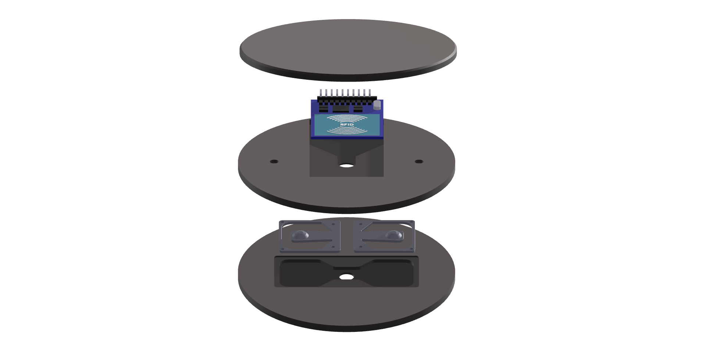

# Smart Coaster: The Future of Service Begins on the Table

Welcome to the official repository for the **Smart Coaster**, an intelligent IoT solution designed to revolutionize the gastronomy industry by staying one step ahead of guest needs.

## 🚀 Business Pitch: Why Smart Coaster?
The gastronomy sector currently faces rising personnel costs, a shortage of skilled labor, and high service pressure. Traditional manual beverage monitoring is time-consuming and error-prone, often leading to empty glasses and lost revenue.

Our Smart Coaster transforms this process. By utilizing **weight-based fill-level detection** and **RFID identification**, it informs service staff in real-time when a guest needs a refill—before the guest even notices.

**Key Value Propositions:**
* **Boost Revenue:** Minimize wait times to maximize beverage sales.
* **Staff Relief:** Reduce manual control walks, allowing staff to focus on high-quality guest interaction.
* **Enhanced Experience:** Ensure guests never sit in front of an empty glass, increasing satisfaction and loyalty.

---

## 🛠 Technical Architecture
The system is built on a robust, interdisciplinary stack that combines precise sensor technology with cloud-based communication.

### System Overview

*Figure 1: Exploded view of the Smart Coaster's mechanical and electronic assembly.*

1. **Sensing:** A **KERN CK 10-Y4 Load Cell** measures the precise weight of the glass.
2. **Identification:** An **NXP MFRC-522 RFID Module** identifies the specific glass or drink type via passive tags.
3. **Processing:** An **Arduino Nano ESP32 (ESP32-S3)** serves as the central brain, processing signals and classifying states (Full, Half-full, Empty).
4. **Signal Conditioning:** The **HX711 24-bit ADC** amplifies the tiny millivolt signals from the load cell for digital processing.
5. **Connectivity:** Data is transmitted via the **MQTT protocol** to a central dashboard.

---

## 📊 Feature Highlights
* **Intelligent Logic:** Software-side tolerance buffers (15g) prevent data "flickering" caused by table vibrations or drafts.
* **Real-time Dashboard:** A GUI displays the exact milliliter fill level and triggers an "Empty Warning" when the level drops below 10%.
* **Automatic Calibration:** The system features an interactive startup calibration to ensure high measurement accuracy.

*Figure 2: The Smart Coaster concept: "Smarter Service begins on the table".*

---

## 👥 The Team
This project was developed at **Hochschule Düsseldorf (HSD)** for the **Smart Systems II** module under Professor Dr.-Ing. Protogerakis.

| Name | Role |
| :--- | :--- |
| **Maxim Speczyk** | Project Lead & Software |
| **Bünyamin Budak** | Software & Visualisation |
| **Cecilia Koehn** | Design, Hardware Concept & Marketing |
| **Clemens Birmes** | Hardware Lead & 3D Construction |
| **Marouane Grar** | System Integration & Components |
| **Marc Maxelon** | Documentation & Quality Assurance |

---

## 📈 Future Roadmap
* **Miniaturization:** Integration of all components onto a custom PCB.
* **Energy Autonomy:** Moving from wired power to rechargeable batteries with inductive charging.
* **Visual Feedback:** Implementation of an LED ring to signal status directly to the guest.
* **Payment Integration:** Enabling the coaster to serve as a direct interface for mobile payments.
